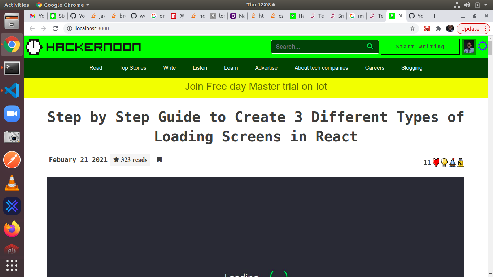
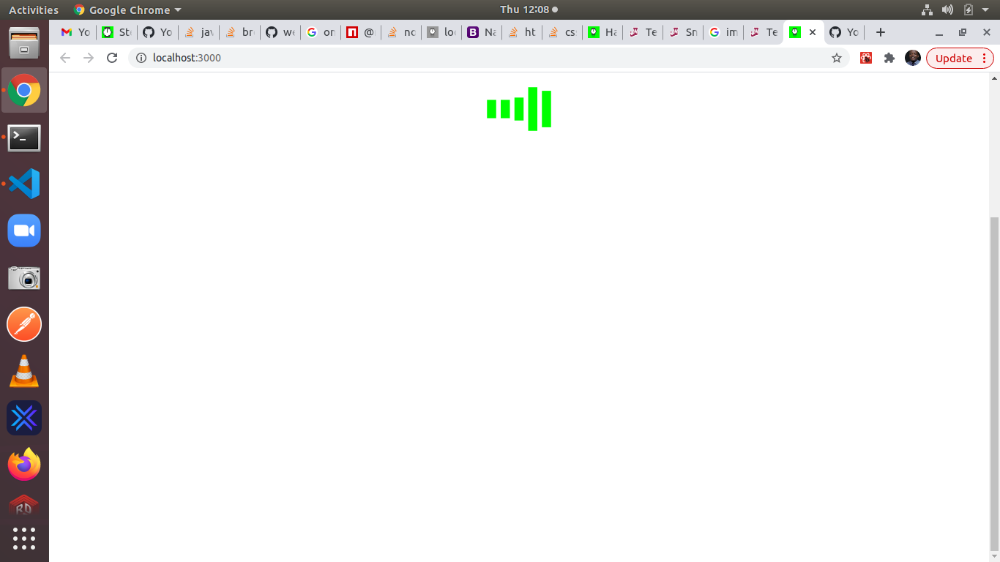
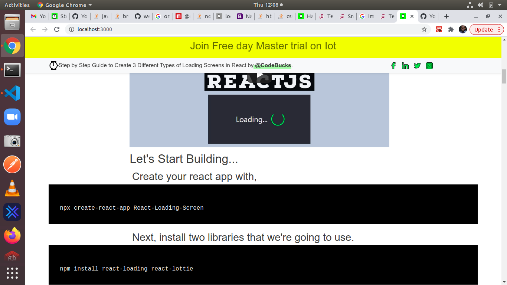

## App description
#### This is a hackernoon fetch page clone, This is a typical front end application built as part of my journey to become a developer at Hackernoon. In this application I am using React functional component with hooks, I am leveraging the power of bootstrap to make with CSS for styling.





## Technologies

- Jsx
- Javascript
- Bootstrap
- React
- CSS

## Core packages
- React-loading
- HTML-to-react 
- 

## Features
- Read data from store
- Wait for 5s loading to complete
- View loading screen as data loads for 5s
- View page after load

> In this project I am not making actual Api calls, I mimic the delay in the Api request as it may happen in a real Api request with setTimeout function, to give us a small delay for our loading page to be seen.

## Improvement

- In this project, we are able to fix the horizontal scroll that occurs on the actual page.

## Future Improvement

- Make all links responsive
- Connect to actual DB
- add transition property in styling
- Increase unit and Integration testing

## Live demo

[View the application by clicking this link](https://hackernoons.herokuapp.com/)

## How to set up and use app

In the project directory, you can run:
- ``` git clone https://github.com/Forison/Hackernoon```,
- ``` cd Hackernoon```
- ``` npm start ```

> You may enter the command below to run your test in development 
- ``` npm test ```

> Open [http://localhost:3000](http://localhost:3000) to view it in the browser

## Reference

[page](https://hackernoon.com/step-by-step-guide-to-create-3-different-types-of-loading-screens-in-react-lu2633nd)

## Author

👤 **Addo Forison**


## Contact

[LinkedIn](https://www.linkedin.com/in/forison/) | [Twitter](https://twitter.com/addo_forison)

## Inspired by
[page](https://hackernoon.com/step-by-step-guide-to-create-3-different-types-of-loading-screens-in-react-lu2633nd)
